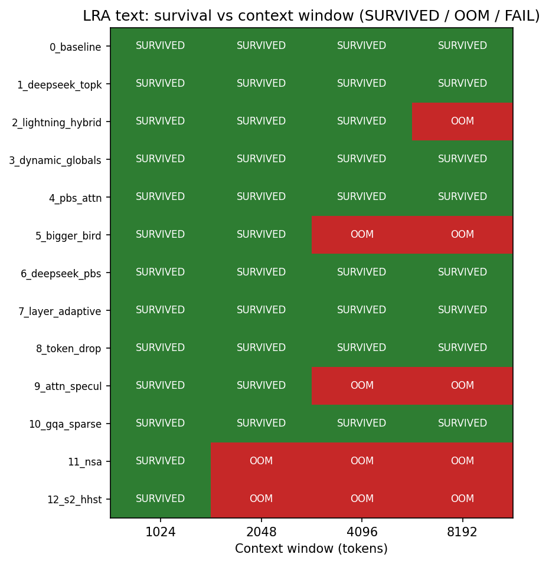
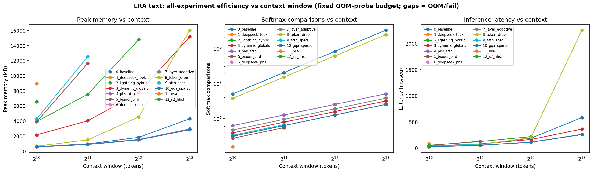
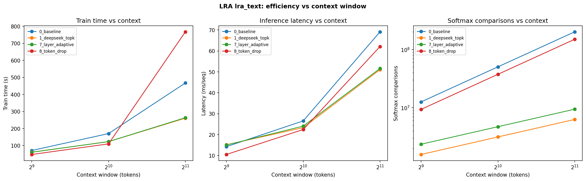
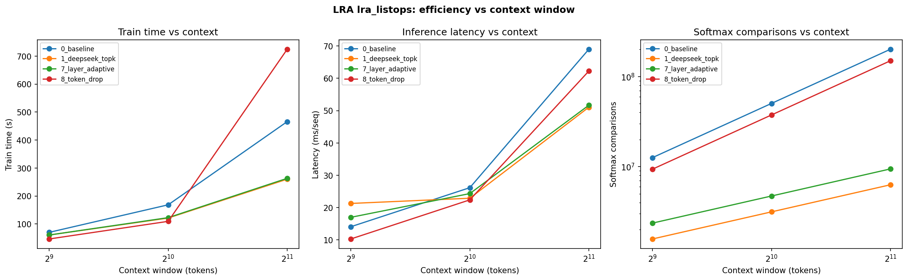
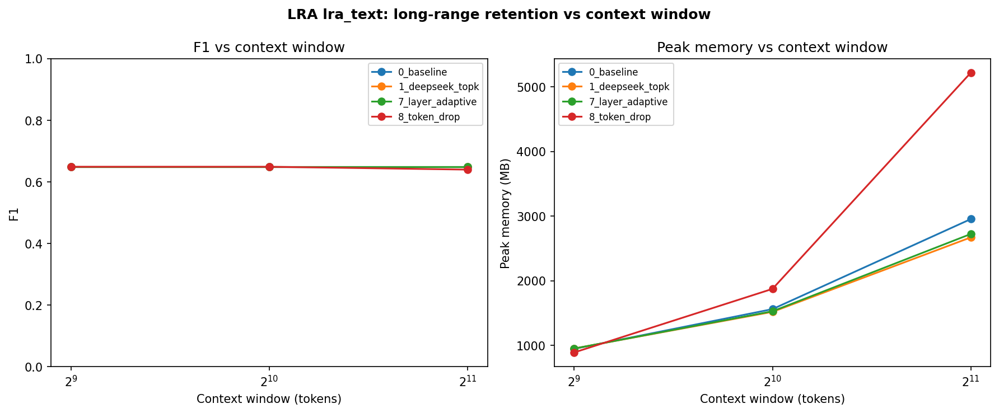
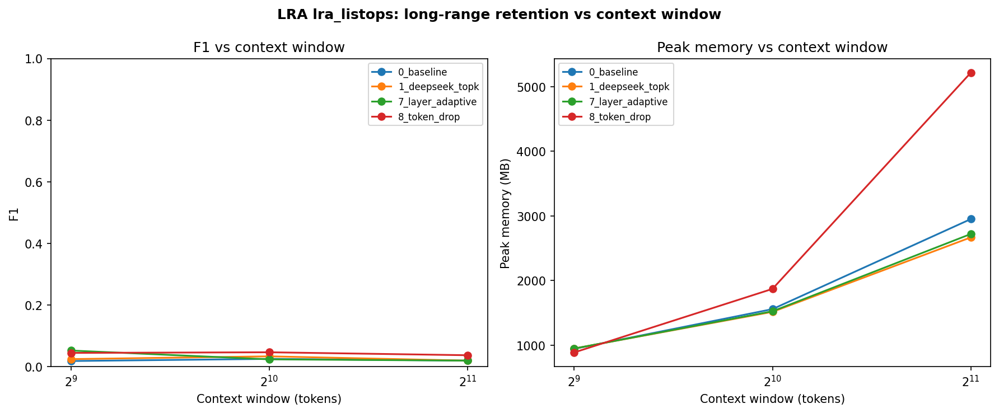
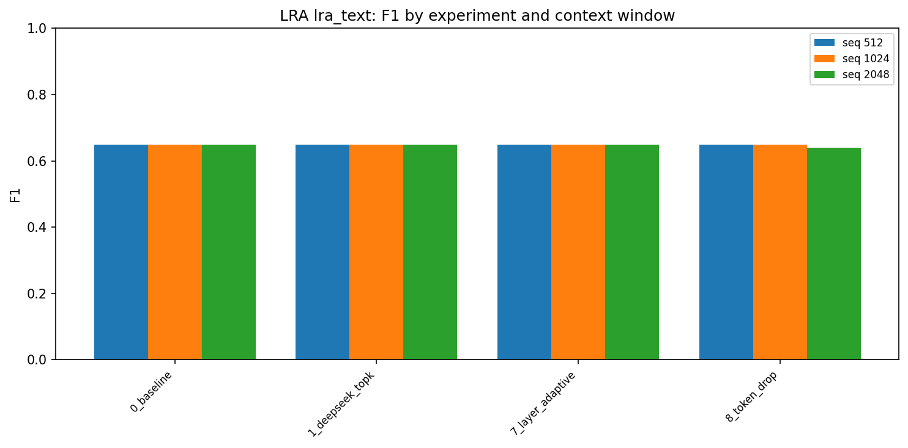
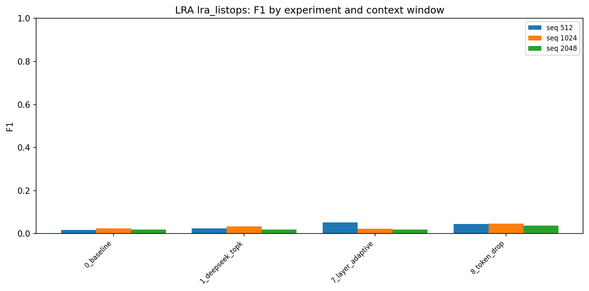

# Long Range Arena Evaluation Report

**Sparse Attention on Genuine Long-Range Inputs**

| | |
|---|---|
| **Date** | June 20, 2026 |
| **Hardware** | NVIDIA GTX 1660 SUPER (6 GB VRAM, fp32) on WSL2 |
| **Backbone** | From-scratch BART-shaped encoder (d=512, 6 layers, 8 heads, ffn=2048) |
| **Tasks** | LRA ListOps (10-way), LRA Text (binary byte-level) |
| **Methods** | All 13 sparse-attention experiments (0 baseline + 12 designs) |

---

## Executive Summary

We evaluated 13 sparse-attention mechanisms on Long Range Arena (LRA) tasks — benchmarks designed to test whether models can use information across hundreds to thousands of tokens. Unlike the prior IMDb sweep (fixed-length padding on short reviews), LRA inputs are genuinely long and structurally require distant dependencies.

Three questions drove this work:

1. **Do sparse methods scale to long context without OOM?**
2. **Does softmax work stay sub-quadratic as context grows?**
3. **Does sparsity preserve accuracy on long-range structure?**

### Key findings

| Question | Answer |
|---|---|
| OOM / survival | Five methods genuinely fit in VRAM at 8192 tokens (~2.9 GB): DeepSeek Top-K, PBS, DeepSeek+PBS, Layer-Adaptive, GQA+Sparse. NSA and S2-HHST OOM earliest (2048). Several others "survive" only by spilling to host RAM (10–16 GB). |
| Softmax scaling | Routed methods sit **20–32× below dense** at seq 2048 and grow ~linearly; dense grows quadratically. |
| Train time | DeepSeek Top-K and Layer-Adaptive cut training time **~1.8×** vs dense at seq 2048. |
| Accuracy / F1 | **Not yet meaningful** at the compute budget used here (500 samples, 3 epochs). All methods sit at chance or majority-class performance. A full-budget run is required for accuracy claims. |

The pipeline, metrics, and visualizations are complete. The efficiency and survival results are actionable today; accuracy comparisons await more compute.

---

## Methodology

### Tasks

- **ListOps** — synthetic nested arithmetic expressions; 10-way classification; tests hierarchical reasoning over structured sequences.
- **Text** — byte-level IMDb sentiment; binary classification; tests long-document classification.

Both use task-native vocabularies (char/byte IDs) and fixed-length padding to the sweep's target sequence length.

### Model

A randomly initialized BART-shaped encoder replaces the pretrained BART-base used in the IMDb experiments. Each of the 13 experiment modules patches `BartAttention` with its sparse mechanism. Classification pools the `[CLS]` token at position 0.

### Sweeps

Two complementary sweeps were run:

| Sweep | Budget preset | Scope | Purpose |
|---|---|---|---|
| **OOM / survival** | `lra-oom` (32 train, batch 1, 1 epoch) | All 13 exps × Text × {1024, 2048, 4096, 8192} | Isolate memory behavior and OOM thresholds |
| **Efficiency / retention** | `lra-report` (500 train, batch 4, 3 epochs) | {0, 1, 7, 8} × {ListOps, Text} × {512, 1024, 2048} | Measure scaling of time, memory, softmax, and F1 |

### Metrics

- **Peak memory (MB)** — max GPU allocation during training
- **Softmax comparisons** — hardware-independent count of key positions attended per query (proxy for attention FLOPs)
- **Train time (s)** — wall-clock for full training run
- **Inference latency (ms/seq)** — forward-pass time per sequence
- **F1 / accuracy** — task-appropriate classification metrics (macro F1 for ListOps, binary F1 for Text)

### WSL2 caveat

On WSL2, CUDA spills past the 6 GB VRAM cap into system RAM instead of immediately OOM-ing. A "SURVIVED" run with peak memory ≫ 6 GB was thrashing host memory (e.g. Lightning Hybrid took ~51 min for one seq-1024 run). **Peak memory is the honest efficiency signal**, not the binary survive/OOM label alone.

---

## Results

### 1. OOM / Survival — All 13 Experiments

The survival matrix below shows whether each method completed a forward+backward pass at each context window under the fixed OOM-probe budget. Green = survived; red = CUDA OOM.



*Figure 1 — Survival matrix for LRA Text across all 13 experiments and four context windows (1024–8192).*

#### Survival table

| # | Experiment | Max context | Peak memory | Classification |
|---|---|---|---|---|
| 0 | Baseline (dense) | 8192 | 4.3 GB | SDPA-efficient |
| 1 | DeepSeek Top-K | 8192 | **2.85 GB** | VRAM-efficient |
| 2 | Lightning Hybrid | 4096 | 14.8 GB | Host-spill; OOM @8192 |
| 3 | Dynamic Globals | 8192 | 15.2 GB | Host-spill |
| 4 | PBS | 8192 | **2.95 GB** | VRAM-efficient |
| 5 | Bigger Bird | 2048 | 11.6 GB | OOM @4096 |
| 6 | DeepSeek+PBS | 8192 | **2.85 GB** | VRAM-efficient |
| 7 | Layer-Adaptive | 8192 | **2.90 GB** | VRAM-efficient |
| 8 | Token-Drop | 8192 | 16.0 GB | Host-spill |
| 9 | Attn-Speculation | 2048 | 12.5 GB | OOM @4096 (32 GiB alloc) |
| 10 | GQA + Sparse | 8192 | **2.85 GB** | VRAM-efficient |
| 11 | NSA | 1024 | 8.9 GB | OOM @2048 |
| 12 | S2-HHST | 1024 | 6.5 GB | OOM @2048 |

**Takeaway:** The five methods that genuinely fit in VRAM at 8192 tokens share a routed/block-sparse design (DeepSeek Top-K, PBS, DeepSeek+PBS, Layer-Adaptive, GQA+Sparse). The paper-ported kernels (NSA, S2-HHST) and window-heavy designs (Bigger Bird, Attn-Speculation) hit OOM earliest. Token-Drop, Dynamic Globals, and Lightning Hybrid technically survive but at 3× the memory cost of the efficient cluster.

---

### 2. All-Experiment Efficiency vs Context

The three-panel chart below plots peak memory, softmax comparisons, and inference latency for all 13 experiments under the same OOM-probe budget. Gaps in a line indicate OOM or failure at that context length.



*Figure 2 — Peak memory, softmax comparisons, and inference latency for all 13 experiments on LRA Text (fixed OOM-probe budget; line gaps = OOM/fail).*

#### Reading the three panels

**Peak memory (left):** Two distinct clusters emerge. The efficient band (~2.9 GB at 8192) contains the routed top-k / block / GQA methods. A steep 12–16 GB band contains windowed, global, and token-drop methods that spill to host RAM before OOM-ing.

**Softmax comparisons (middle, log scale):** Routed methods are 1–2 orders of magnitude below dense and grow approximately linearly with context. Dense attention grows quadratically — the gap widens at every doubling.

**Inference latency (right):** The efficient cluster stays flat and low. Host-spilling methods spike sharply at 8192 (Token-Drop exceeds 2,000 ms/seq).

---

### 3. Efficiency Scaling — Moderate Budget (4 Methods)

The moderate-budget sweep trained baseline, DeepSeek Top-K, Layer-Adaptive, and Token-Drop for 3 epochs on 500 samples. These plots show how train time, latency, and softmax work scale as context doubles from 512 to 2048.

#### LRA Text



*Figure 3 — Train time, inference latency, and softmax comparisons vs context for four methods on LRA Text.*

#### LRA ListOps



*Figure 4 — Same efficiency metrics for LRA ListOps.*

#### Scaling table (Text, seq 2048)

| Metric | Baseline (0) | DeepSeek Top-K (1) | Layer-Adaptive (7) | Token-Drop (8) |
|---|---|---|---|---|
| Train time (s) | 467 | **261** | 263 | 768 |
| Peak memory (MB) | 2955 | **2671** | 2724 | 5221 |
| Softmax comparisons | 201 M | **6.3 M (32×)** | 9.4 M (21×) | 150 M (1.3×) |
| Inference latency (ms) | 69 | **51** | 52 | 62 |

Dense train time grows ~2.6× per context doubling (consistent with quadratic attention). DeepSeek Top-K and Layer-Adaptive stay well below that curve. Token-Drop is the negative outlier — slower and more memory-hungry than dense at seq 2048, consistent with its host-spill behavior in the survival sweep.

---

### 4. Long-Range Retention — F1 and Memory vs Context

Retention plots pair F1 score (left) with peak memory (right) as context grows. These answer whether accuracy degrades as sequences get longer — the core "long-range retention" question.

#### LRA Text



*Figure 5 — F1 and peak memory vs context for four methods on LRA Text.*

On Text, F1 is flat at ~0.65 across all methods and context windows — this is the majority-class F1 for a 48% accuracy model (not learned performance). Memory tells the real story: Token-Drop spikes to 5,200 MB at seq 2048 while DeepSeek Top-K and Layer-Adaptive stay at ~2,700 MB.

#### LRA ListOps



*Figure 6 — F1 and peak memory vs context for four methods on LRA ListOps.*

On ListOps, all F1 scores sit near 0.02–0.05 (chance for 10-way is ~0.10 accuracy, F1 ≈ 0.02). Token-Drop shows marginally higher F1 at shorter contexts but its memory curve diverges sharply at 2048 — the same host-spill pattern seen elsewhere.

---

### 5. F1 Comparison Across Methods

Grouped bar charts show F1 per experiment at each context window. These are included for completeness; at the current compute budget the bars reflect under-training, not method quality.

#### LRA Text



*Figure 7 — F1 comparison across four methods and three context windows on LRA Text.*

#### LRA ListOps



*Figure 8 — F1 comparison across four methods and three context windows on LRA ListOps.*

| Task | Observed F1 | Eval loss | Interpretation |
|---|---|---|---|
| ListOps (10-way) | 0.02–0.05 | ≈ 2.29 (ln 10 = 2.30) | Chance — model has not learned |
| Text (binary) | ≈ 0.649 | ≈ 0.70 (ln 2 = 0.69) | Majority class — model has not learned |

**Why F1 is flat:** from-scratch encoders trained on 500 samples for 3 epochs (~190 optimizer steps) cannot converge. LRA models in the literature train for thousands of steps on full splits. The accuracy axis is implemented and runs correctly; it needs `--size lra-full` on a larger GPU before any method-vs-method accuracy claim is valid.

---

## Conclusions

### What this evaluation establishes

1. **The LRA pipeline works end-to-end** for all 13 sparse-attention modules on genuinely long inputs, producing dashboard-compatible JSON and CSV artifacts.
2. **OOM is a discriminating test.** Five methods genuinely fit in 6 GB VRAM at 8192 tokens. NSA and S2-HHST fail earliest. Token-Drop, Dynamic Globals, and Lightning Hybrid only "survive" by thrashing host memory.
3. **Efficiency scaling reproduces the O(n) thesis** on real long-range data — softmax 20–32× below dense, sub-quadratic train time — decoupled from IMDb padding artifacts.
4. **Accuracy awaits full-budget training.** Everything is wired; the bottleneck is compute, not code.

### Recommended next steps

| Priority | Action |
|---|---|
| High | Run `--size lra-full` on a ≥24 GB GPU for meaningful F1 comparisons across all 13 methods |
| Medium | Add ListOps to the all-13 OOM sweep (currently Text-only) |
| Medium | Integrate survival matrix and all-efficiency plots into the [Bigger Bird dashboard](https://bigger-bird-dashboard.vercel.app/) |
| Low | Run LRA Retrieval once AAN corpus is available (`scripts/get_lra_data.sh`) |

---

## Reproduce

```bash
# OOM / survival sweep (all 13 experiments)
python run_lra_sweep.py --tasks text --exps 0,1,2,3,4,5,6,7,8,9,10,11,12 \
  --seqs 1024,2048,4096,8192 --size lra-oom
cp benchmarks/lra_sweep_results.json benchmarks/lra_oom_results.json

# Moderate efficiency / retention sweep
python run_lra_sweep.py --tasks listops,text --exps 0,1,7,8 \
  --seqs 512,1024,2048 --size lra-report

# Generate all figures, tables, and CSV
python viz/lra_viz.py

# Full-budget accuracy (recommended, needs a larger GPU)
python run_lra_sweep.py --tasks listops,text \
  --exps 0,1,2,3,4,5,6,7,8,9,10,11,12 --seqs 1024,2048,4096 --size lra-full
```

### Artifacts

| Path | Description |
|---|---|
| `benchmarks/lra_<task>_<exp>/eval_*.json` | Per-run metrics (dashboard-compatible) |
| `benchmarks/lra_oom_results.json` | Survival sweep summary |
| `benchmarks/lra_comparison.csv` | Consolidated CSV for all moderate-budget runs |
| `benchmarks/lra_*.png` | All figures referenced in this report |
